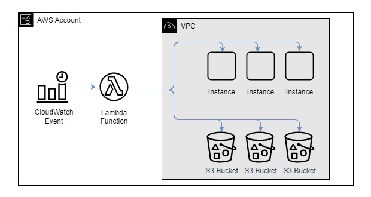

# Hands-on Boto3, Lambda: Implement EC2 Scheduler & S3 Compliance Checker

Purpose of this hands-on training is to provide additional exposure to Boto3 and Lambda to develop an EC2 Scheduler and S3 compliance validator.  The scheduler will stop instances after hours and restart them at the beggining of the day.  The S3 compliance validator will ensure that all S3 buckets in the account have versioning enabled, to remain compliant with the company's storage policies.  These are practical problems that are faced in organizations today.

## Learning Outcomes

At the end of the this hands-on training, students will be able to:

- create a Lambda function and necessary roles and policies

- be able to use the boto3 SDK, specifically with the 'EC2' resource

- parse json output from AWS using boto3

- write a python script from scratch


## Outline

- Part 1 - Review design and pseudocode for Lambda function

- Part 2 - Create test instances

- Part 3 - Setup your AWS credentials file

- Part 4 - Implement and test the Lambda function

- Part 5 - Deploy the Lambda function

- Part 6 - Create a Lambda role

- Part 7 - Create a CloudWatch scheduled event

- Part 8 - Test your function

- Part 9 - Create test buckets

- Part 10 - Modify to check for S3 buckets with versioning disabled

- Part 11 - Test you code via Visual Studio Code

- Part 12 - Deploy your code via the Lambda console

- Part 13 - Update the Lambda role

- Part 14 - Delete your resources!

## Architecture



## Application Flow


## Part 1 - Review pseudocode for Lambda function

- Review the proposed architecture

- Review the application flow diagram

- Review the file `pseudocode.py`

Note: Notice the process being used here. Creating a design is important before going hands-to-keyboard for any project.  In this case the design consists of a design diagram and pseudocode.


## Part 2 - Create test instances

- Open the Amazon EC2 console at https://console.aws.amazon.com/ec2/

- Choose Instances on the left-hand menu

- Click on 'Launch Instances'

```text
- Number of instances           : 3
- Name                          : <yourname>-scheduled-server
- Click 'Add additional tags' beside 'Name'
- Add these tags:
-   SchedulerStartTime : 8
-   SchedulerStopTime : 18
- Amazon Machine Image (AMI)    : Amazon Linux 2023 AMI (hvm|ena|ebs|x86_64)
- Instance Type                 : t2.micro
- Key pair name                 : choose your key pair
- Network:                      : no changes required
```


- Click on 'Launch Instances' again

```text
- Number of instances           : 2
- Name                          : <yourname>-no-schedule-server
- Amazon Machine Image (AMI)    : Amazon Linux 2023 AMI (hvm|ena|ebs|x86_64)
- Instance Type                 : t2.micro
- Key pair name                 : choose your key pair
- Network:                      : no changes required
```


## Part 3 - Setup your AWS credentials file

- Python will use your credentials file behind the scenes every time you make a AWS API call via boto3

- AWS access keys:
    - ensure you have valid keys from AWS IAM for your IAM user
    - if you do not:
        - open the AWS IAM console
        - click `Users` on the left menu
        - click on your IAM user name
        - click on the `Security credentials` tab
        - under `Access keys`, click on `Create access key`
        - for use case, select `Local code`
        - check the box indicating you understand the recommendation and click `Next`
        - add a `Description`
        - click on `Create access key`
        - Store your access key and secret access key somewhere SAFE
        - You will not be able to see your secret access key again after you navigate away from this page

- From a terminal:
    - type `aws configure`
    - enter your access key
    - enter your secret access key
    - for region enter `us-east-1`
    - for output enter `json`


## Part 4 - Implement and test the Lambda function

- Create a file called `awscode.py`.  This will be your Lambda script.

- Import the necessary modules and functions that you will need
    - boto3
    - json
    - datetime from the module datetime
    - pytz


- Implement a `lambda_handler` that returns without doing anything
    - what is a `lambda_handler`?
    - why do we pass the `event` and `context` parameters to it?
    - make sure you comment the function; why do we add these comments?

- Implement the lines of code that will allow the `lambda_handler` to be called from the IDE for testing purposes
    - before deploying the Lambda function, it can be tested and debugged in your IDE; testing and debugging in Lambda directly is not advised

- Take a few moments to review the boto3 ec2 reference page with a focus on the `describe_instances` function (https://boto3.amazonaws.com/v1/documentation/api/latest/reference/services/ec2.html)
    - which parameters are required?
    - what `data structure` is returned as part of the response?
    - how would you know if there were 0 instances returned based on your criteria?
    - how would you know exactly how many instances are returned from the function?
    - how would you access the `instance id` from that data structure?
    - how would you access the `instance state` from that data structure?
    - how would you access the `tags` from that data structure?


- Add the lines of code in the `lambda_handler` to implement the following pseudocode:
    - get a list of instances with the required tags
    - if there are no instances, print a message and exit
    - get the current hour
    - iterate over the list of instances
    -   at this time, only print the instance id, we will return to this step
    - print a message that processing is complete
    - question:
        - what would happen if we don't use the timezone to get the current hour?

- Test the code you have written so far
    - run it in debug mode and `step over` each line
    - note the variables shown in the window on the left side of the screen (VS Code)
    - how many instances did you create? how many are returned in the function? why?
    - why are we running this function now?  why not write all of the code first?
    - which IAM entity is used to make the boto3 function / API call to AWS?

- Implement the `process_instance()` function
    - implement this function which takes an `instance` and `current_hour` as input and realizes the psedocode below:
        - if instance is running and stop_time is now, stop it
        - if instance is stopped and start_time is now, start it
        - in all other cases, leave the instance as is
    - the function should return a message indicating the acion that was taken

- In the `lambda_handler`, replace the `print` statement with a call to the `process_instance()` function

- Add a `try-except` block in the lambda_handler
    - why would this be needed?

- Test and debug the entire script


## Part 5 - Deploy the Lambda function

- Open the Lambda console in AWS

- Click on `Create Function`

- Details:
    - Choose `Author from scratch`
    - Function name:        <yourname>-ec2-s3-checker
    - Runtime:              Python 3.11 (or later)
    - Architecture:         leave as is
    - Execution role:       leave as is
    - Advanced settings:    leave as is

- Change default timeout for Lambda function
    - why is this necessary?
    - what is the longest time a Lambda function can run?
    - From the function details window:
        - Click the `Configuration` tab
        - Click `General configuration`
        - Click `Edit`
        - Change timeout to `1 min 0 sec`

- Go back to `Function overview` and deploy the code:
    - Click on the `Code` tab
    - In the `lambda_function` tab, delete the existing code
    - Paste your code in the same tab
    - Click `Deploy`
    - Create a test configuration with the default JSON configuration
    - Test the function
    - Questions:
        - what permissions does your lambda role have?
        - what more permissions does it need?
        - what would have happened without the try-except block?
        - how did the print messages help?
        - how long did it take for the function to execute?
        - what would have happened if the timeout wasn't extended?


## Part 6 - Update the Lambda role

- On the `Function overview` page, click `Configuration`

- Click on `Permissions`

- Click on the role name (note this was created automatically when the Lambda function was created)

- On the `Permissions` tab of the IAM role, notice which permissions the Lambda role already has
    - why is this needed?

- Click on `Add permissions` | `Inline policy`

- Click on `EC2` and add the following permissions:
    - `EC2:StartInstances`
    - `EC2:StopInstances`
    - `EC2:DescribeInstances`

- Click `Next`

- Type `<yourname>-ec2-s3-checker-policy` for the policy name

- Click `Create policy`

- Go back and test your function


## Part 7 - Create a CloudWatch scheduled event

- Open the CloudWatch console

- Click on `Rules` (this takes you to EventBridge)

- Click the `Create rule` button

- Enter the following details:
    - Name:         `<yourname>-ec2-s3-check`
    - Description:  `Scheduled rule to check ec2 instances and s3 buckets`
    - Event bus:    leave as `default`
    - Enable:       leave `enabled`
    - Rule type:    select `Schedule`

- Click `Continue to create rule`

- Enter the cron schedule as: cron(* * * * ? *):
    - this schedules the job to run every minute
    - Note that practically you would not run this every MINUTE, but every HOUR most likely; we are running every minute just for testing purposes

- Click `Next`

- Under Select target(s), choose `AWS Service` and select `Lambda function`

- Select your lambda function

- Click `Next` and `Next` again, then `Create rule`


## Part 8 - Test your function

- Check the CloudWatch logs and see that your function is running

- Modify the tags on your EC2 instances and see that they stop and start as they should


## Part 9 - Create test buckets

- Open the Amazon EC2 console at https://console.aws.amazon.com/s3/

- Choose `Create bucket`
    - Enter a name such as <yourname>-testbucket-disabled-001
    - Leave the remaining defaults, including versioning being "DISABLED"
    - Repeat this 3 times (change the 001 to 002, then 003)

- Choose `Create bucket`
    - Enter a name such as <yourname>-testbucket-enabled-001
    - Change the versioning setting to be "ENABLED"
    - Repeat this 2 times (change 001 to 002)


## Part 10 - Modify to check for S3 buckets with versioning disabled

- Create a function `process_buckets()` which, first, gets a list of buckets

- Next iterate over the list and send them to a `process_bucket()` function to check if versioning is enabled
    - If not, enable versioning


## Part 11 - Test your code via Visual Studio Code

- Ensure the new code works via Visual Studio Code

- Go back and change the buckets named "***-disabled***" to "suspend" bucket versioning (note you cannot disable it now)


## Part 12 - Deploy your code via the Lambda console

- Ensure the new code works via Visual Studio Code

- Go back and change the buckets named "***-disabled***" to "suspend" bucket versioning (note you cannot disable it now)

- Run your code.  What happens?


## Part 13 - Update the Lambda role

- On the `Function overview` page, click `Configuration`

- Click on `Permissions`

- Click on the role name

- On the `Permissions` tab, click the `+` sign on the inline policy you created earlier

- Choose `Edit`

- Click `+ Add more permissions`

- Under `Select a service`, click on `S3` and add the following permissions:
    - `S3:ListAllMyBuckets`
    - `S3:GetBucketVersioning`
    - `S3:PutBucketVersioning`

- Click `Next`

- Click `Save changes`

- Go back and test your function


### Part 14 - Delete your resources!

- Delete the CloudWatch (EventBridge) rule

- Delete the lambda function

- Delete the lambda role

- Delete the log group in CloudWatch logs

- Terminate the 5 test instances

- Delete the 5 test buckets
